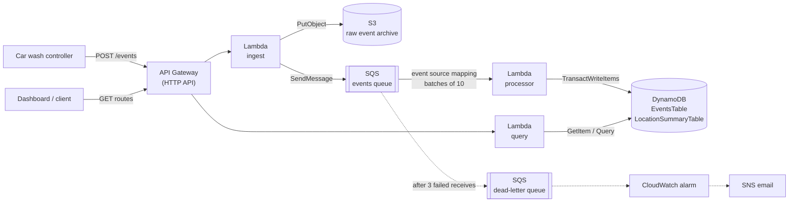
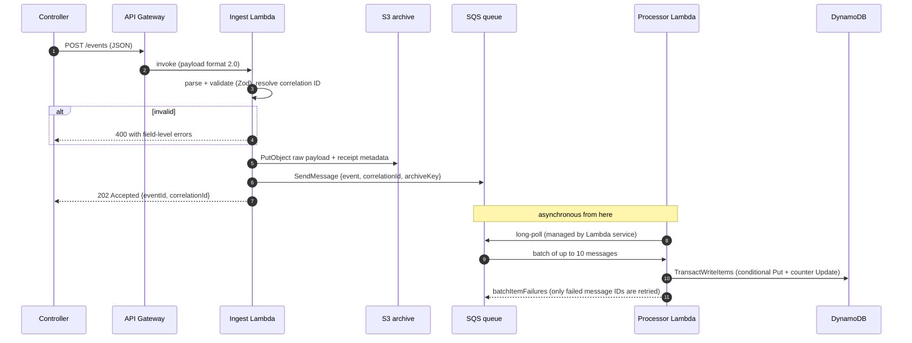

# WashOps: Serverless Car Wash Event Integration Service

An event-driven integration layer on AWS that ingests operational events from car wash equipment controllers (washes, payments, equipment faults, heartbeats), archives every raw payload, processes events asynchronously and idempotently, and exposes per-location operational summaries through an HTTP API.

Built with **TypeScript**, **AWS Lambda (Node.js 22)**, **API Gateway**, **SQS + dead-letter queue**, **S3**, **DynamoDB**, **CloudWatch**, and **IAM**, defined entirely as infrastructure as code with **AWS SAM**.

> **Status:** deployed to a personal AWS account (us-east-1) and verified end to end, including duplicate delivery and a poison message flowing through retries into the DLQ. I built this project to get hands-on AWS experience; the sections below describe what is implemented, and anything conceptual is labeled as a future improvement.

---

## Contents

- [Business problem](#business-problem)
- [Architecture](#architecture)
- [AWS services and why each exists](#aws-services-and-why-each-exists)
- [Request flow](#request-flow)
- [Asynchronous processing](#asynchronous-processing)
- [Reliability and failure handling](#reliability-and-failure-handling)
- [Idempotency](#idempotency)
- [Security and IAM](#security-and-iam)
- [Data model](#data-model)
- [Observability](#observability)
- [Local development](#local-development)
- [Testing](#testing)
- [AWS deployment](#aws-deployment)
- [CI/CD](#cicd)
- [API reference and examples](#api-reference-and-examples)
- [Design decisions](#design-decisions)
- [Tradeoffs](#tradeoffs)
- [Future production improvements](#future-production-improvements)

---

## Business problem

A car wash site is a set of physical systems: tunnel controllers, pay stations, dryers, pumps. Each produces a stream of events that business software needs: wash volume, revenue, equipment health, and whether the site is even online.

That integration layer has to cope with the realities of edge devices:

- **Unreliable networks.** Controllers retry, so the same event can arrive more than once.
- **Bursty traffic.** A Saturday morning looks nothing like a Tuesday night.
- **Downstream failures.** A database hiccup must not cause lost transactions or failed requests at the site.
- **Auditability.** When a revenue number looks wrong, someone needs to see exactly what the controller sent.

WashOps accepts events quickly, stores the original payload durably, and processes each event exactly once into queryable operational state.

## Architecture



The write path (ingest) and the read path (query) are separate Lambdas with separate IAM roles. The API never waits on DynamoDB, so a slow or failing processor cannot cause failed requests at the car wash.

## AWS services and why each exists

| Service | Role in WashOps | Without it |
|---|---|---|
| **API Gateway (HTTP API)** | Managed HTTPS front door: routing, TLS, throttling, access logs. Invokes Lambda per request. | We'd run and patch a web server fleet, load balancer, and TLS termination ourselves. |
| **AWS Lambda** | Runs stateless handlers on demand; scales by running more concurrent copies; billed per millisecond. | Always-on servers sized for peak load, sitting idle overnight. |
| **Amazon SQS** | Durable buffer that decouples ingestion from processing. Messages survive processor outages for up to 4 days (configured). | Ingestion would call the database synchronously; any downstream failure becomes a failed or lost event. |
| **SQS dead-letter queue** | Quarantines messages that fail repeatedly so they stop consuming retries and can be inspected and redriven. | A poison message retries until it expires and is silently lost, or blocks attention from real failures. |
| **Amazon S3** | Low-cost, highly durable archive of every raw payload as received: audit trail and replay source. | No record of what a controller actually sent once validation or processing transforms it. |
| **Amazon DynamoDB** | Serverless key-value store for processed events and pre-aggregated location summaries; conditional writes provide idempotency. | Managing database capacity, connections, and patching; connection pooling problems from many concurrent Lambdas. |
| **Amazon CloudWatch** | Centralized logs (Logs Insights queries over structured JSON), SQS/Lambda metrics, and alarms. | No visibility into a distributed system spanning three functions and a queue. |
| **Amazon SNS** | Delivers alarm notifications by email. | Alarms change state in the console but nobody is told. |
| **AWS IAM** | A dedicated execution role per function, scoped to exactly the resources it uses. | Shared or wildcard credentials: one bug or compromise could touch everything. |
| **AWS SAM / CloudFormation** | The whole environment (about 30 resources) defined in `template.yaml`: reviewable, repeatable, and removable with one command. | Hand-built console resources that drift and can't be reproduced or code-reviewed. |

## Request flow



1. **Validate at the edge.** The body is parsed and validated against a discriminated union of five event schemas. Timestamps are normalized to UTC, and money must have at most two decimal places.
2. **Correlation ID.** A caller-supplied `x-correlation-id` is reused if well-formed; otherwise a UUID is generated. It is returned in the response, carried through SQS, logged by every function, and stored on the DynamoDB item.
3. **Archive first, then enqueue.** Every message on the queue therefore has a raw S3 record behind it.
4. **Return `202 Accepted`.** The contract is "durably received", not "processed".

## Asynchronous processing

The processor is triggered by an **SQS event source mapping**: the Lambda service long-polls the queue on the function's behalf, using the function's IAM role, and invokes it with batches of up to 10 messages.

- **Partial batch responses** (`ReportBatchItemFailures`): the handler returns only the IDs of messages that failed. Successful messages in the same batch are deleted instead of being reprocessed.
- **Visibility timeout (60 s):** a received message is hidden from other consumers while it is being processed. It is 6× the function timeout, per AWS guidance, so a slow invocation doesn't cause the same message to be delivered to a second consumer mid-flight.
- **Bounded concurrency** (`MaximumConcurrency: 5`): caps parallel consumers so a large backlog drains steadily instead of stampeding downstream systems.
- **Measured latency:** warm processing took roughly 60–150 ms from `receivedAt` to `processedAt`; cold starts added about 0.4–0.5 s of init time per function.

## Reliability and failure handling

| Scenario | What happens | Verified |
|---|---|---|
| **Invalid event** | Ingest returns `400` with every field error at once. Nothing is written to S3, SQS, or DynamoDB. | ✅ deployed + unit test |
| **Ingestion Lambda crashes or times out** | API Gateway returns `5xx`; nothing was acknowledged, so the controller retries. If S3/SQS had already succeeded, the retry produces a duplicate message, which the processor dedupes. | Design |
| **S3 unavailable** | The SDK retries transient errors (3 attempts, exponential backoff with jitter). If it still fails, ingest returns `500` and does **not** enqueue, preserving "every queued event is archived". | ✅ unit test |
| **SQS temporarily unavailable** | SDK retries; then `500` to the controller, which retries. The already-written S3 object remains as a harmless receipt of the failed attempt. | Design |
| **Processor throws** (bug, DynamoDB error) | That message is reported in `batchItemFailures`, stays on the queue, and reappears after the visibility timeout for another attempt. Other messages in the batch are unaffected. | ✅ unit test |
| **Poison message** (can never succeed) | Fails on every receive. After `maxReceiveCount` (3) SQS moves it to the DLQ with its original body and ID; the DLQ alarm notifies via SNS. | ✅ deployed: 3 attempts ~60 s apart, moved to DLQ, alarm fired ~2.5 min later |
| **Same event delivered twice** | The conditional write detects the existing `eventId`, the transaction is cancelled, and the processor logs `DUPLICATE` and acknowledges the message. Counters are unchanged. | ✅ deployed + unit test |
| **DynamoDB throttling or errors** | SDK retries first; persistent failure fails that message only, and SQS retries it later. Because each write is one atomic transaction, a retry can never leave a half-applied update. Sustained failure lands messages in the DLQ for redrive after recovery. | ✅ unit test |
| **Processing stalled** (bad deploy, permissions) | Messages accumulate on the queue (4-day retention). The `processing-stalled` alarm fires when the oldest message is over 5 minutes old. | Design |

**Redriving the DLQ** after a fix moves messages back to the source queue:

```bash
aws sqs start-message-move-task --source-arn <DeadLetterQueueArn>
```

## Idempotency

Standard SQS guarantees **at-least-once** delivery. Duplicates are normal in distributed systems: a Lambda can time out after writing to DynamoDB but before SQS records the deletion, a controller can retry after a network blip swallowed our `202`, and SQS itself may occasionally deliver a message twice.

WashOps makes processing safe to repeat:

```text
TransactWriteItems (all-or-nothing)
 ├─ Put    EventsTable[eventId]           IF attribute_not_exists(eventId)   ← idempotency record
 └─ Update LocationSummaryTable[location] ADD completedWashes 1, washRevenueCents 2200
```

- The **event record and the counter increment commit atomically.** Writing them separately would open a window where a crash either loses the increment or double-counts on retry.
- If the `eventId` already exists, DynamoDB cancels the transaction with `ConditionalCheckFailed` on item 0. The processor treats that as success (`DUPLICATE`) so SQS deletes the message instead of retrying it.
- **Heartbeats take a different path on purpose.** "Move `lastHeartbeat` forward to T" is *naturally* idempotent, so it uses a single conditional update (`lastHeartbeat < :ts`). That also prevents an out-of-order, older heartbeat from moving the value backwards, since standard SQS does not guarantee ordering.
- Money is stored as **integer cents** (`19.99 * 100 === 1998.9999999999998` in JavaScript).

Verified in AWS: resending `evt-1001` returned `202`, the processor logged `outcome: DUPLICATE`, and `completedWashes` stayed at `1`.

## Security and IAM

**No credentials exist in code or configuration.** Each Lambda runs as its own **execution role**. The Lambda service assumes the role and injects short-lived credentials that the AWS SDK picks up automatically.

Roles are declared explicitly in `template.yaml` rather than using SAM's generated roles, because the generated roles attach AWS-managed policies with `Resource: "*"` (for example, the SQS poller policy). Every statement below names a specific resource ARN:

| Role | Allowed actions | Resources |
|---|---|---|
| `IngestFunctionRole` | `logs:CreateLogStream`, `logs:PutLogEvents` | its own log group |
| | `s3:PutObject` | `raw-events-bucket/raw/*` only |
| | `sqs:SendMessage` | the events queue |
| `ProcessorFunctionRole` | `logs:CreateLogStream`, `logs:PutLogEvents` | its own log group |
| | `sqs:ReceiveMessage`, `sqs:DeleteMessage`, `sqs:GetQueueAttributes` | the events queue (used by the event source mapping) |
| | `dynamodb:PutItem`, `dynamodb:UpdateItem` | the two tables (authorizes the transaction's operations) |
| `QueryFunctionRole` | `logs:CreateLogStream`, `logs:PutLogEvents` | its own log group |
| | `dynamodb:GetItem` | the two tables |
| | `dynamodb:Query` | `EventsTable/index/LocationActivityIndex` only |

Each role's **trust policy** allows only `lambda.amazonaws.com` to assume it. The ingest function cannot read S3 or touch DynamoDB, and the query function cannot write anything.

Other controls in place:

- **Resource-based policies:** SAM generates a Lambda permission per route so only this API can invoke each function.
- **S3:** all public access blocked, ACLs disabled (`BucketOwnerEnforced`), SSE-S3 encryption, and a bucket policy that **denies** any non-TLS request. Its `Principal: "*"` is a Deny, so it grants nothing.
- **SQS:** server-side encryption (SSE-SQS). **DynamoDB:** encrypted at rest by default.
- **API throttling:** stage-level rate/burst limits (25 rps / 50 burst) cap abuse and cost.
- **Input hardening:** a 64 KB body limit, strict ID formats (IDs become S3 keys and DynamoDB keys), and generic `500` bodies that never leak internal errors.

> **Known gap (demo scope):** the API is **not authenticated**. SAM flags this at deploy time and it was explicitly accepted for the demo. A production design would authenticate controllers; see [future improvements](#future-production-improvements).

## Data model

DynamoDB tables are designed around access patterns, not normalization:

| Access pattern | Implementation |
|---|---|
| Record an event exactly once | `EventsTable` PK `eventId` + conditional put |
| Get a processed event by ID | `GetItem` on `EventsTable` |
| Get a location's current summary | `GetItem` on `LocationSummaryTable` (counters maintained at write time, a materialized view) |
| Latest activity for a location, newest first | `Query` GSI `LocationActivityIndex` (PK `locationId`, SK `activityAt`), `ScanIndexForward=false` |

- **Sparse index:** heartbeat items omit `activityAt`, so they never enter the GSI. A controller pinging every minute doesn't bury real activity.
- **TTL:** `expiresAt` auto-deletes event items (90 days; 7 for heartbeats) at no cost. Summaries are kept.
- **Revenue rule:** wash revenue is recognized on `WASH_COMPLETED`. `PAYMENT_COMPLETED` is tracked separately (`paymentsCompleted`, `paymentVolume`) so money is never counted twice.

S3 keys use Hive-style partitions so the archive can later be queried with Athena without moving data:

```text
raw/date=2026-09-14/location=miami-01/evt-1001_<correlationId>.json
```

Every receipt gets its own object, so a retried request never overwrites the audit record of the original.

## Observability

All functions emit one JSON object per line to stdout. CloudWatch Logs Insights can query those fields directly.

**Trace one event across both Lambdas** (log groups `/aws/lambda/washops-ingest` and `/aws/lambda/washops-processor`):

```sql
fields @timestamp, service, message, outcome
| filter correlationId = '69015492-23c1-45a4-a94d-5060e4b4d13d'
| sort @timestamp asc
```

```text
2026-09-14 23:38:59.986  washops-ingest     Event received
2026-09-14 23:39:00.080  washops-ingest     Event accepted
2026-09-14 23:39:00.139  washops-processor  Event processed
```

**Processing outcomes:**

```sql
filter ispresent(outcome) | stats count(*) as events by outcome
```

**Why was something rejected:**

```sql
filter message = 'Event rejected' | stats count(*) by reason, statusCode
```

API Gateway access logs (`/aws/vendedlogs/washops/http-api-access`) record `requestId`, `status`, and `integrationStatus`/`integrationError`, which separates "API Gateway problem" from "our code returned an error". The same `apiRequestId` appears in the ingest Lambda's logs.

**Alarms** (SNS email):

| Alarm | Condition | Meaning |
|---|---|---|
| `washops-dlq-not-empty` | DLQ visible messages > 0 | Events are failing repeatedly and need investigation |
| `washops-processing-stalled` | Oldest queue message > 5 min for 5 min | Processor is down, misconfigured, or falling behind |

## Local development

**Prerequisites:** Node.js 22+, npm.

```bash
npm ci
npm run typecheck   # tsc --noEmit (strict)
npm run lint        # ESLint + typescript-eslint
npm test            # Vitest unit tests
npm run build       # esbuild bundle of all handlers into dist/ (sanity check)
npm run verify      # all of the above
```

```text
src/
  handlers/        Lambda entry points (thin): ingest.ts, processor.ts, query.ts
  domain/          business rules, no AWS SDK: event schemas, counter rules
  aws/             everything that talks to AWS: S3 archive, SQS, DynamoDB store, SDK clients
  shared/          structured logger, HTTP helpers, errors, config
tests/             unit tests with mocked AWS SDK clients
events/            sample payloads
scripts/           send-sample-events.mjs: exercises a deployed API
template.yaml      all infrastructure (AWS SAM)
```

Development here is unit-test-first against mocked SDK clients, followed by deployment to a real AWS account. `sam local invoke` / `sam local start-api` are available if Docker is installed, but were not part of this workflow.

## Testing

Unit tests use Vitest and [`aws-sdk-client-mock`](https://github.com/m-radzikowski/aws-sdk-client-mock), which intercepts AWS SDK v3 `send()` calls. The real handler code runs, with no AWS access needed.

| Area | What is tested |
|---|---|
| Validation | Valid events; missing/unsafe IDs; non-ISO timestamps; negative and sub-cent amounts; unsupported `eventType` message; UTC normalization; unknown fields stripped |
| Ingestion | `202` with S3 key format and SQS envelope; correlation ID propagation; `400` touches no AWS resources; malformed JSON; S3 failure returns `500` and does not enqueue |
| Processing | `WASH_COMPLETED` → one transaction with conditional put and correct counter increments (cents); duplicate delivery treated as success; DynamoDB throttling fails only that message; poison messages reported without blocking the batch; stale heartbeat ignored and heartbeats excluded from the GSI |
| Query | Cents → dollars mapping; `404` for unprocessed events; GSI query newest-first; `limit` validation |
| Money | Floating-point conversion to integer cents |

End-to-end behavior was verified against the deployed stack (see [API reference and examples](#api-reference-and-examples)). Automated integration tests against a deployed stage are listed under future improvements.

## AWS deployment

**Prerequisites:** an AWS account, [AWS CLI v2](https://docs.aws.amazon.com/cli/latest/userguide/getting-started-install.html), and [AWS SAM CLI](https://docs.aws.amazon.com/serverless-application-model/latest/developerguide/install-sam-cli.html).

1. **Authenticate with temporary credentials** (no long-lived access keys):

   ```bash
   aws configure set region us-east-1
   aws login                      # browser sign-in, returns short-lived credentials
   aws sts get-caller-identity    # confirm which identity you're using
   ```

2. **Build and deploy:**

   ```bash
   npm ci
   npm run sam:build              # runs `sam build` with node_modules/.bin (esbuild) on PATH
   sam deploy --guided            # first time; afterwards just `sam deploy`
   ```

   `sam deploy` uploads the bundles to a SAM-managed S3 bucket, creates a CloudFormation **changeset** (a preview of every resource to add, modify, or replace), and applies it after confirmation. A failed deployment rolls back automatically.

   Guided deploy asks for `AlarmEmail` (optional; confirm the SNS email) and `LogRetentionDays`, and requires acknowledging IAM role creation (`CAPABILITY_IAM`) and the unauthenticated API routes.

3. **Try it:**

   ```bash
   node scripts/send-sample-events.mjs <ApiBaseUrl>
   ```

> **Build note:** SAM's esbuild builder does not find esbuild when it is only a project devDependency, so `npm run sam:build` runs `sam build` through npm, which puts `node_modules/.bin` on PATH. Avoid `sam build --build-in-source` with this layout: it performs a production-only install in the project directory, which removes devDependencies.

**Cost:** everything is pay-per-use with no idle compute. Demo-scale usage costs cents or less. The two CloudWatch alarms and a few MB of logs/objects are the only standing items.

**Teardown:**

```bash
aws s3 rm s3://<RawEventsBucketName> --recursive   # CloudFormation can't delete a non-empty bucket
sam delete --stack-name washops
```

## CI/CD

`.github/workflows/ci.yml` runs on every push to `main` and every pull request:

| Job | Steps |
|---|---|
| **verify** | `npm ci` → typecheck → lint → unit tests → esbuild bundle |
| **sam** | install SAM CLI → `sam validate --lint` (cfn-lint) → `sam build` |

The workflow's token is limited to `contents: read`, and CI needs **no AWS credentials**.

### Continuous deployment with GitHub OIDC (documented, not implemented)

Deployment from GitHub Actions should not use stored AWS access keys. Instead:

1. Create an IAM **OIDC identity provider** for `token.actions.githubusercontent.com`.
2. Create a deploy role whose trust policy only accepts tokens from this repository's `main` branch:

   ```json
   {
     "Effect": "Allow",
     "Principal": { "Federated": "arn:aws:iam::<ACCOUNT_ID>:oidc-provider/token.actions.githubusercontent.com" },
     "Action": "sts:AssumeRoleWithWebIdentity",
     "Condition": {
       "StringEquals": { "token.actions.githubusercontent.com:aud": "sts.amazonaws.com" },
       "StringLike": { "token.actions.githubusercontent.com:sub": "repo:<OWNER>/washops:ref:refs/heads/main" }
     }
   }
   ```

3. Add a deploy job. GitHub issues a signed, short-lived token per run, which AWS STS exchanges for temporary role credentials:

   ```yaml
   deploy:
     needs: [verify, sam]
     if: github.ref == 'refs/heads/main'
     runs-on: ubuntu-latest
     permissions:
       id-token: write   # allow requesting the OIDC token
       contents: read
     steps:
       - uses: actions/checkout@v5
       - uses: actions/setup-node@v5
         with: { node-version-file: .nvmrc, cache: npm }
       - uses: aws-actions/setup-sam@v2
       - uses: aws-actions/configure-aws-credentials@v4
         with:
           role-to-assume: arn:aws:iam::<ACCOUNT_ID>:role/washops-github-deploy
           aws-region: us-east-1
       - run: npm ci
       - run: npm run sam:build
       - run: sam deploy --no-confirm-changeset --no-fail-on-empty-changeset
   ```

## API reference and examples

Responses below were captured from the deployed stack. The base URL is the `ApiBaseUrl` stack output.

### `POST /events`

```bash
curl -i -X POST "$API/events" \
  -H "content-type: application/json" \
  -H "x-correlation-id: demo-trace-0001" \
  -d @events/wash-completed.json
```

```http
HTTP/1.1 202 Accepted
x-correlation-id: demo-trace-0001

{"message":"Event accepted","eventId":"evt-1001","correlationId":"demo-trace-0001"}
```

Supported `eventType` values and their `data`:

| eventType | data |
|---|---|
| `WASH_STARTED` | `washPackage`, `bayId?` |
| `WASH_COMPLETED` | `washPackage`, `amount`, `durationSeconds` |
| `PAYMENT_COMPLETED` | `amount`, `paymentMethod` (`CARD`/`CASH`/`MOBILE`/`MEMBERSHIP`), `transactionId?` |
| `EQUIPMENT_FAULT` | `equipmentId`, `faultCode`, `severity` (`LOW`/`MEDIUM`/`HIGH`/`CRITICAL`), `message?` |
| `CONTROLLER_HEARTBEAT` | `controllerId`, `firmwareVersion?`, `uptimeSeconds?` |

**Validation failure** (`events/invalid-event.json`):

```json
HTTP 400
{
  "message": "Event failed validation",
  "correlationId": "0f0d5863-d037-44ff-bec2-fa7ec072a258",
  "errors": [
    { "path": "locationId", "message": "locationId must be 2-64 characters: lowercase letters, digits, -" },
    { "path": "timestamp", "message": "Invalid ISO datetime" },
    { "path": "data.amount", "message": "Too small: expected number to be >=0" },
    { "path": "data.amount", "message": "amount must have at most 2 decimal places" }
  ]
}
```

**Unsupported event type:**

```json
HTTP 400
{
  "message": "Event failed validation",
  "errors": [
    { "path": "eventType", "message": "eventType must be one of: WASH_STARTED, WASH_COMPLETED, PAYMENT_COMPLETED, EQUIPMENT_FAULT, CONTROLLER_HEARTBEAT" }
  ]
}
```

### `GET /locations/{locationId}/summary`

```json
HTTP 200
{
  "locationId": "miami-01",
  "washesStarted": 1,
  "completedWashes": 2,
  "totalRevenue": 44,
  "paymentsCompleted": 1,
  "paymentVolume": 22,
  "equipmentFaults": 1,
  "lastHeartbeat": "2026-09-14T23:38:58.809Z",
  "lastUpdated": "2026-09-14T23:39:00.670Z"
}
```

This was captured after sending three `WASH_COMPLETED` requests, one of which was a duplicate `eventId`, so `completedWashes` is 2.

### `GET /events/{eventId}`

```json
HTTP 200
{
  "eventId": "evt-1001",
  "locationId": "miami-01",
  "eventType": "WASH_COMPLETED",
  "occurredAt": "2026-09-14T18:30:00.000Z",
  "receivedAt": "2026-09-14T23:34:36.768Z",
  "processedAt": "2026-09-14T23:34:38.272Z",
  "correlationId": "demo-trace-0001",
  "archiveKey": "raw/date=2026-09-14/location=miami-01/evt-1001_demo-trace-0001.json",
  "data": { "washPackage": "Premium", "amount": 22, "durationSeconds": 312 }
}
```

Returns `404` if the event has not been processed, including an event that was accepted and is still on the queue.

### `GET /locations/{locationId}/events?limit=20`

Most recent non-heartbeat events for a location, newest first (`limit` 1–50, default 20).

```json
HTTP 200
{
  "locationId": "miami-01",
  "count": 5,
  "events": [
    { "eventId": "evt-mu1vwo6w-fault", "eventType": "EQUIPMENT_FAULT", "occurredAt": "2026-09-14T23:38:28.809Z", "...": "..." },
    { "eventId": "evt-mu1vwo6w-wash",  "eventType": "WASH_COMPLETED",  "occurredAt": "2026-09-14T23:37:58.808Z", "...": "..." }
  ]
}
```

## Design decisions

- **Async ingestion with `202 Accepted`.** Site equipment gets a fast, reliable acknowledgement independent of downstream health.
- **Archive before enqueue.** This guarantees a raw record exists for every event that enters processing, which is useful for audits and replays after a processing bug.
- **Transactional idempotency in DynamoDB.** The dedupe record and its side effect commit atomically, which is simpler and safer than a separate idempotency table.
- **Explicit IAM roles.** They are auditable least privilege, visible in code review, instead of generated policies with wildcard resources.
- **HTTP API over REST API.** It is lower cost and latency and has everything this service uses (routes, throttling, access logs, Lambda proxy).
- **arm64 (Graviton) Lambdas.** Lower price per GB-second for pure JavaScript workloads.
- **esbuild bundles.** One minified file per function with source maps; stack traces point to TypeScript lines (`processor.ts:21`).
- **Validation in two places.** At the API (reject bad input early, with useful errors) and again in the processor, because the queue is also a trust boundary (other producers, deployment skew).
- **Tolerant reader.** Unknown fields are stripped rather than rejected, so newer controller firmware doesn't break ingestion; the S3 archive keeps the untouched payload.
- **Structured logging without a framework.** A 50-line logger writes JSON directly to stdout so the Lambda runtime doesn't prefix it and Logs Insights can index fields.

## Tradeoffs

| Choice | Benefit | Cost |
|---|---|---|
| Standard SQS (not FIFO) | Near-unlimited throughput, simple | No ordering guarantee and duplicates possible, handled via idempotency and conditional heartbeat updates |
| Pre-aggregated counters | O(1) summary reads | Counters can't be recomputed by query; correcting history means replaying from S3 |
| DynamoDB transactions | Atomic dedupe + update | Transactional writes consume 2× write capacity |
| One S3 object per event | Simple, independent audit records | Per-request PUT cost becomes significant at high volume (batching via Firehose would be cheaper) |
| AWS SDK bundled into each function | Pinned, tested SDK version | ~1 MB bundles and slightly slower cold starts than using the runtime-provided SDK |
| `maxReceiveCount: 3` | A poison message reaches the DLQ in ~3 min (good for a demo) | AWS recommends at least 5 for Lambda consumers to avoid DLQ-ing messages during brief throttling |
| Unauthenticated API | Easy to exercise | Not acceptable for production |
| Single Lambda for three GET routes | Fewer resources and cold starts | Routes share one role and scaling profile |

## Future production improvements

These are **not implemented**:

- **Authentication for controllers:** IAM SigV4 with per-site roles (e.g. IAM Roles Anywhere), mutual TLS on a custom domain, or a JWT authorizer. Add AWS WAF (via a REST API or CloudFront).
- **Environments and delivery:** separate dev/staging/prod accounts, the OIDC deploy pipeline above, integration tests against a deployed stage, and gradual Lambda rollouts with `AutoPublishAlias` + CodeDeploy canaries and alarm-based rollback.
- **Observability:** distributed tracing (AWS X-Ray / OpenTelemetry), custom business metrics via Embedded Metric Format, a CloudWatch dashboard, and alarms on API 5xx, Lambda errors/throttles, and DynamoDB throttling. Powertools for AWS Lambda could replace the hand-written logger.
- **Data durability:** DynamoDB point-in-time recovery and `DeletionPolicy: Retain`; S3 versioning, lifecycle transition to Glacier, and Object Lock where audit retention is regulated.
- **Replay and analytics:** a replay tool that re-enqueues archived S3 events; Athena/Glue over the partitioned archive; a documented DLQ redrive runbook.
- **Scale:** Kinesis Data Streams or Firehose for very high event rates and batched archiving; FIFO queues with `MessageGroupId = locationId` if strict per-site ordering becomes a requirement; reserved concurrency; pagination tokens on list endpoints.
- **Integration fan-out:** EventBridge to publish processed events to other consumers (loyalty, maintenance ticketing, BI) without coupling them to this service.
- **Relational integration:** location master data (sites, owners, pricing) typically lives in a relational system such as Aurora PostgreSQL. A natural pattern is DynamoDB Streams → Lambda → PostgreSQL for reporting, or enrichment from the relational system on the read path, using RDS Proxy for connection pooling. This was scoped out of the build to keep the focus on the AWS event pipeline.
- **Schema evolution:** versioned event contracts (`schemaVersion`), contract tests shared with controller firmware teams, and a schema registry.

## License

[MIT](LICENSE)
